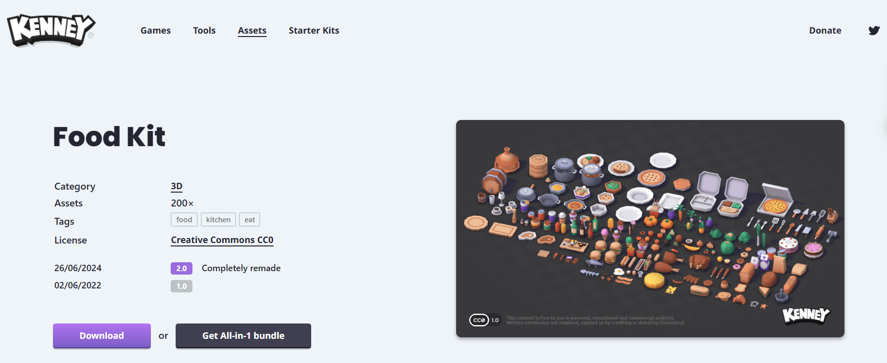

# 🎮 **Nesne Eşleştirme Final Oyunu**

Unity kullanılarak geliştirilmiş, WebGL uyumlu bir eşleştirme oyunudur. Oyuncuların nesneleri fareyle sürükleyerek yerleştirdiği, doğru eşleşmelerde puan kazandığı, yanlış seçerse cezalandırıldığı basic bir projedir.

---

## 📎 **Bağlantılar**
- [Oyun Bağlantısı](https://play.unity.com/en/games/64b49bf2-2994-4999-b734-ee5d3896a638/match-foods)

---

## 📌 **Proje Genel Bakış**

- **10 Dalgalı Oyun Mekaniği:** Oyun toplamda 10 farklı dalga içerir. Her dalgada zorluk seviyeleri artar.
- **WebGL Build:** Oyun, Unity Play üzerinden WebGL olarak yayınlanmıştır. Package Manager'dan WebGL Publisher paketi import edilmiştir.
- **Eşleşme ve Geri Bildirim Mekanikleri:**
  - **Doğru Yerleştirme:** Nesneler doğru eşleştirildiğinde animasyonlar ve ses efektleri ile geri bildirim sağlanır.
  - **Yanlış Yerleştirme:** Hatalı eşleşmelerde nesneler fırlatılır ve ekran sarsıntısı oynatılır.
- **Yetenek Butonları:**
  - **Skor Katlayıcı ve Ek Can:** Geçici olarak skorları ikiye katlar ve oyuncuya +1 can ekler.
  - **Pair ID'leri Göster:** 10 saniye boyunca tüm nesnelerin pair ID'lerini gösterir.
  - **Cooldown Mekaniği:** Her iki yetenek için sırasıyla 10 ve 20 saniyelik bir bekleme süresi uygulanır.
- **Dinamik UI:**
  - Skor, can ve dalga sayısı oyun boyunca takip edilir ve gerçek zamanlı güncellenir.
  - UI öğeleri sezgisel ve kullanıcı dostu bir yapıdadır.
- **Dotween Animasyonları:** Doğru ve yanlış eşleşmeler için görsel efektler ve hareketli animasyonlar sağlanmıştır.
- **Zorluk Seviyeleri:**
  - Her dalgada yeni nesneler spawn edilir ve oyun sürekli olarak devam eder.
  - 10. dalgayı tamamlayan oyuncular kazandıkları bir ekrana yönlendirilir.

---

## 🎮 **Oynanış ve Özellikler**

- **Oynanış Akışı:**
  - Oyuncular, rastgele yerleştirilen nesneleri fareyle sürükleyerek alanlara bırakır.
  - Her eşleşme doğruysa puan kazanılır, yanlışsa can kaybedilir.
  - Tüm nesneler eşleştirildiğinde bir sonraki dalgaya geçilir.
  - Oyuncu, canı biterse kaybetme ekranına yönlendirilir.

---

## 📋 **UI ve Yönetimi**

- **Skor Göstergesi:** Oyuncunun toplam puanı, her dalgada güncellenir.
- **Can Göstergesi:** Oyuncunun mevcut can durumu takip edilir.
- **Dalga Göstergesi:** Oyuncunun hangi dalgada olduğu UI üzerinden görüntülenir.
- **Yetenek Cooldown:** Yetenek butonlarında cooldown süresi geri sayım olarak gösterilir
- **Yetenek Butonları:**
Skor Katlayıcı ve Ek Can: Geçici olarak skorları ikiye katlar ve oyuncuya +1 can ekler. 10 saniyelik cooldown süresine sahiptir.
Pair ID'leri Göster: 10 saniye boyunca tüm nesnelerin pair ID'lerini gösterir. 20 saniyelik cooldown süresine sahiptir.

---

## 📦 **Obje Paketi**

- Projede kullanılan objeler, Unity'nin **Kenney Food Kit** asset paketinden alınmıştır.

**Obje Paketi Görüntüsü:**  

---

## 🕹️ **Ek Teknik Detaylar**

- **Ses ve Görsel Efektler:**
  - Başarı ve başarısızlık durumları için ses efektleri ve partikül animasyonları bulunmaktadır.
- **Prefab Kullanımı:** Oyundaki nesneler düzenli bir yapı sağlamak için prefab teknikleriyle organize edilmiştir.
- **Dalga Yönetimi:** 10 dalga tamamlandıktan sonra oyuncular kazandınız ekranına yönlendirilir.

---

## ▶️ **Kurulum ve Çalıştırma**

1. Unity 2022.3.31f sürümünü indirin.
2. Projeyi Unity'de açın ve **FinalScene** sahnesini yükleyin.
3. Oyunu çalıştırmak için **Play** butonuna basın.
4. WebGL build'i görmek için Unity Play bağlantısını kullanın: [Oyun Bağlantısı](https://play.unity.com/en/games/64b49bf2-2994-4999-b734-ee5d3896a638/match-foods)
